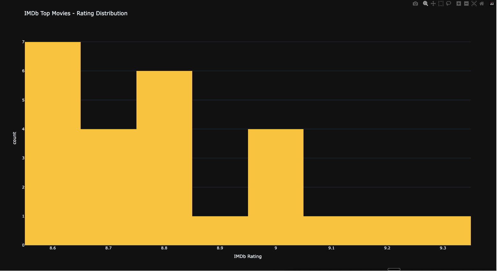
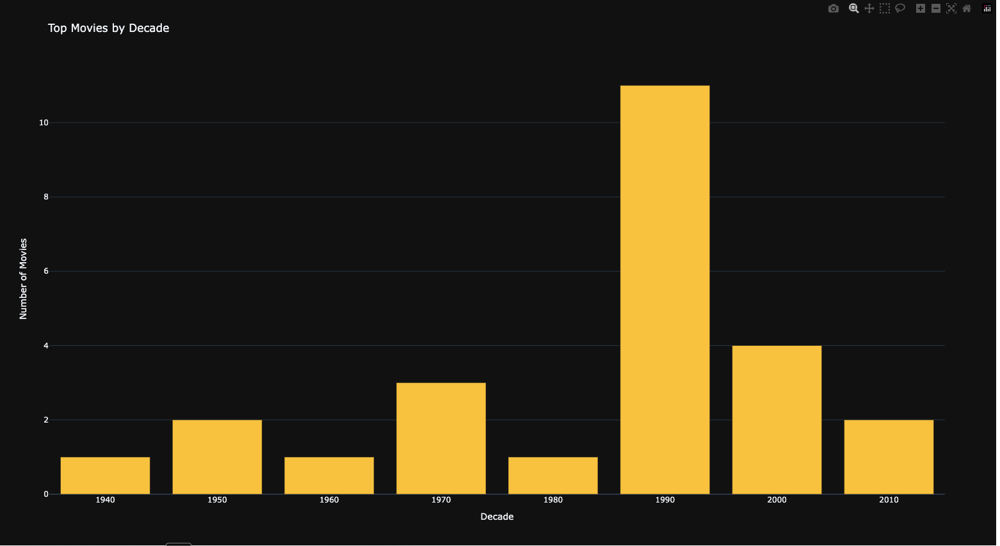
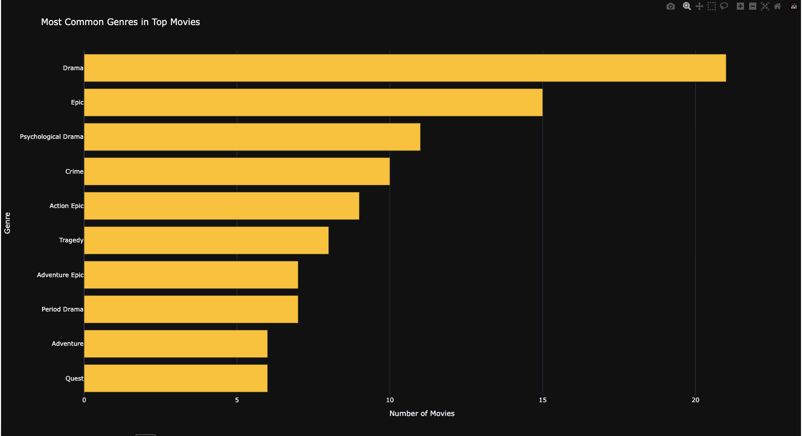
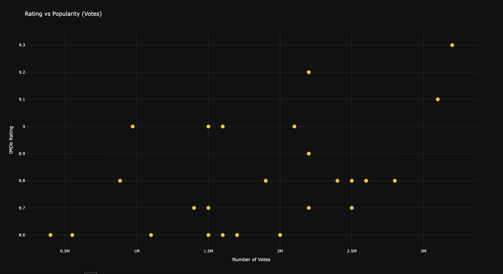

# IMDb Top 250 Scraper

A Python web scraper that extracts movie data from IMDb's Top 250 list and creates interactive visualizations.

## What it does

Scrapes the following data for each movie:
- Title, Release year, IMDb rating, Number of votes
- Poster image URL
- Genres, Duration, Director, Writers, Actors, Plot

## Visualizations

### Rating Distribution


### Movies by Decade


### Most Common Genres


### Rating vs Popularity


## Project Structure
```
imdb-scraper/
├── data/
│   ├── raw/                 # Raw HTML files (for debugging)
│   └── processed/           # Clean CSV + HTML charts
├── src/
│   ├── __init__.py
│   ├── scraper.py           # Main scraping logic
│   └── visualizations.py    # Chart generation
├── images/                  # Screenshots for README
├── main.py                  # Entry point
├── requirements.txt
└── README.md
```

## Installation

1. Clone the repository:
```bash
git clone https://github.com/YOUR_USERNAME/imdb-scraper.git
cd imdb-scraper
```

2. Install dependencies:
```bash
pip3 install -r requirements.txt
```

## Usage

**Scrape movies:**
```bash
python3 main.py
```

**Generate charts:**
```bash
python3 src/visualizations.py
```

Output saved to `data/processed/`

## Example Data

| Title | Year | Rating | Votes | Genres |
|-------|------|--------|-------|--------|
| Cadena perpetua | 1994 | 9.3 | 3.2M | Drama, Prison Drama |
| El padrino | 1972 | 9.2 | 2.2M | Crime, Drama, Gangster |
| El caballero oscuro | 2008 | 9.1 | 3.1M | Action, Crime, Drama |

## Tech Stack

- **Python 3** - Programming language
- **BeautifulSoup4** - HTML parsing
- **Requests** - HTTP requests
- **Pandas** - Data handling
- **Plotly** - Interactive visualizations

## What I Learned

- Web scraping fundamentals with BeautifulSoup
- CSS selectors for extracting HTML elements
- Data cleaning and transformation
- Creating interactive charts with Plotly
- Project organization and documentation

## License

MIT License - feel free to use this code for learning!